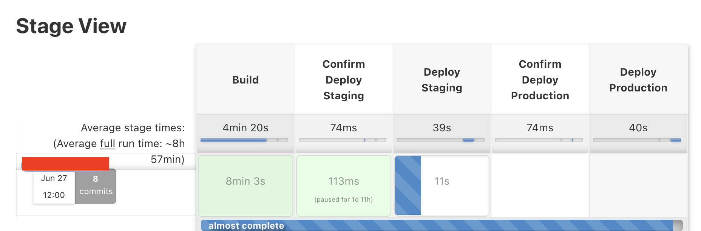
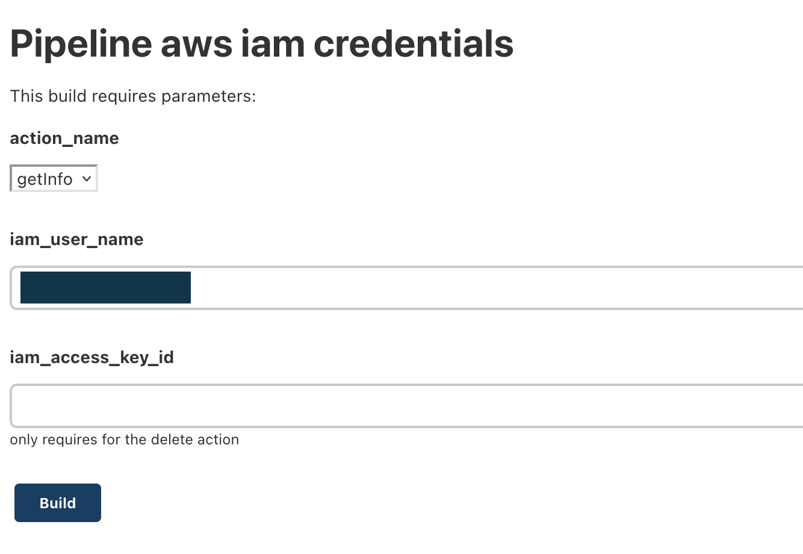

## Intro

Nowadays, there are a variety of choices to deploy a website. Developers could choose a container service like Heroku, or go with the most trendy infrastructure of choice with Kubernetes, or use the Serverless strategy to run the website without the need of setting up the server by their own.
However, configuring a web server is no longer a rocket surgery with the modern Devops technologies and the revolution of the Cloud providers. This post explores in details a simple infrastructure setup with Amazon infrastructure using Terraform, Ansible and Jenkins.
This is a real usecase that fits to a certain software project, therefore it requires some consideration before implementing this setup in another organization.

## Projects setup

To embrace the culture of Agile development, the platform is splitted into multiple small applications which is only taken a couple of sprints from the planning phrase until going live. With that setup, the monorepo is used in order to keep the consistency between these applications in term of development best practice, linting rules, scripting commands, version control. There are a bunch of shared libraries extracted from the apps for the common usages.

Depends on each individual app's purpose, the micro app could involve several technologies. So far the platform heavily uses GraphQL to provide the frontend clients to access. Not only it keeps the number of API as small as 1, it also allows the clients to specify the structure of the response they want to use. These advantages completely convince the team to switch over from the traditional REST (or RESTful) API. Besides GraphQL, GRPC is the main communication protocol from backend to backend services, which allows small apps to communicate with each other with an extremely fast latency.

Other than that, the rest of stack follows the typical setup of a web service. A database (postgresql or mysql) handles the data and a small Redis cluster that acts as a caching layer as well as backend for the jobs' queue. Lastly, the application code is running in one or more server instances, which doesn't produce any state in the server and there could be multiple processes running the code in parralel.

## Infrastructure requirement

The most difficult question when designing the infrastructure is how to maximize the support for the monorepo setup. Each app share a lot in common for the infrastructure requirements such as the configuration of server instances, load balancer, security groups beside a few differences in the exposed ports, protocol, database engine.

Terraform is the only option we have in mind when choosing the tools for building the infrastructure. Terraform comes with a lot of configurations in each resource type and requires user to know how to link these resources together. Not all members in the teams have deep knowledge about the cloud provider (we are using Amazon Web service) in order to write the code correctly. To solve this problem, we come up with a list of custom modules that combine multiple resources together, this helps to setup the infrastructure quickly and error-free. This example may provide a clearer picture of what a module looks like and how it helps to spin up the infrastructure at ease.

```
  module "server_instances" {
    source                                 = "../../../modules/server_instances"
    instances_count                        = 3
    instance_type                          = "t4g.micro"
    instance_ami                           = "ami-xxxxxxxxxxxx"
    instance_root_block_device_volume_size = 10
    instance_app_name                      = "app_name"
    instance_app_env                       = "prod"
    healthcheck_endpoint                   = "/healthcheck"
    public_key                             = var.ssh_public_key
    vpc_id                                 = var.vpc_id
    jenkins_agent_sg_id                    = "sg-jenkinsxxxxxxxx"
    loadbalancer_subnets                   = ["subnet-1", "subnet-2", "subnet-3"]
    loadbalancer_tls_cert                  = "arn:aws:acm:region-1:2356:certificate/XXXX-YYYY-ZZZZ"
  }

```

This module doesn't only create 3 server instances, but also configures a loadbalancer that links to these instance through a target group and allow traffic in and out from these components, plus whitelists the access from Jenkins security group to the instance in order to perform the deployment. The implementation of this "server_instances" module involves 233 lines of Terraform code, 20 resource block usages, provides 16 customized variables, which is quite challenging to write from start to end with no mistake.

Since a "terraform apply" could affect to a numberous of infrastructure components, reviewing the plan carefully and only running the plan if every change looks correct is the practice recommended. Terraform has offered Terraform Enterprise, a paid platform to implement this practice automatically. However, if this is all we need from the Terraform Enterprise, a custom automation Jenkins pipeline might fulfill the job too.

## Everything starts with Jenkins

Jenkins plays an important role in automation and deployment. The Jenkins' jobs or pipelines are represented in the code form, which makes it easier to maintain. The streamline monorepo setup makes it possible to have a single deployment pipeline with the predefined list of application's names. It reduces a lot of work to maintain the consistency of all Jenkins pipelines, as if there are separate deployment job for each service. On another hand, Jenkins can be used to run operational tasks such as refreshing AWS credentials, installing a software into a server, or even provisioning the infrastructure.

In general, to deploy an application, a number of steps are performed, which involves compiling the code, uploading the output to the artifact store, updating the code into server and restarting the app inside the server. Each of the step above may includes a few different tasks, for example, before compiling the code, some code evaluation's task are executed involving checking the dependencies' vulnerabilities, code smells detection, verify the truthiness by running various kind of automation testing. If all the steps are passed, the code is compiled and tagged with a new version, and then stored inthe artifact store. It is ready to move on to the deploy stage.

There are usually multiple deployment environments. A deployment pipeline should define the order of each environment based on its criticalness. The most common setup has 2 environments: staging and production. The staging environment is used for the internal testing, while the production is for the real user to use the service. Since the production is more critical, the deployment pipeline should be able to block failed deployment to staging from being able to trigger into the production environment. It's quite often that after completing the deployment into each environment, the pipeline perform some readiness checks. The check could be simple as checking if the healthcheck endpoint returns a 200 status code or more complicated like running the smoke test, load test, and canary deployment.



On the other hand, most of the automated tasks could be handled by Jenkins. To illustrate what type of jobs could be run in Jenkins, this job handles some operational task related to issuing, revoking, rotating IAM credential's keys. The job takes a few parameters includes the action name, the iam user and the key id (for the delete action). Internally, it performs one of these actions with the given iam user and key, uses a pre-configured AWS keys with sufficient permissions. Typically, these permissions aren't granted to developers' AWS accounts.



As mentioned in the previous section, the Terraform pipeline could be implemented with 3 stages including planning, confirming and applying. This Jenkins job implements the Terraform flow as planning, confirmation, applying the plan. The job allows to run the plan with different modes like refresh only, normal and destroy mode. These operations are well fit to the current devops workload.

## Ansible

If Jenkins is a computer then Ansible is the operating system that run in the computer.
It doesn't only implements the deployment script but also powers the build steps.
This section discusses some of Ansible's strengths in building these operation code.

Firstly, we use Ansible to instruct the application deployment.
The deployment script doesn't limit to the code deployment but also include the checklist to ensure the server is fully setup and operated. It includes tasks to check and install the missing packages, create configuration files and start supporting services, clean up the server after a successful deployment.

Secondly, instead of written the build script in pure Bash script, we use Ansible for the consistency and effeciency.
Ansible is designed with strong declarative syntax, which provides unlimited extendability. For example, when define the test running step, the command we think of is `npm run test`. This is good enough to run the test without dependencies, however, in the real project, it requires to run against dependencies and more than that there are different kinds of test for each application in the monorepo. Taking all of these requirements into account, the Ansible script to run the tests looks like below:

```
# build.yml
- include_tasks:
    file: "{{ item }}"
  with_items: "{{ test_running_files }}"

# vars file
test_running_files:
  - "tests/run_unit_test.yml"
  - "tests/integration_test.yml"
  - "tests/e2e_test.yml"

# integration_test.yml
- name: "Run the integration test suite"
  shell: "docker-compose -f apps/{{ app_name }}/docker-compose.yml --project-directory ./ --project-name {{ app_name }} run integration-test {{ app_name }}"
  args:
    chdir: "{{ workspace_path }}"
  register: test_output
  no_log: true
  ignore_errors: true
- name: "Display test result"
  include_tasks: "../pretty_output.yml"
  vars:
    output: "{{ test_output }}"
```

As the code shows how complicated the test running could be, Ansible is clearly a better choice to build the script due to its extendability. Each application config could override the test_running_files list if necessary.

## All the logs go

To manage several applications with the minimum resources, we need a logging tool where we can locate the problem. Finding the right log entry across multiple apps could be a challenge, however, the first step is to set it up. Amazon offers the OpenSearch service, which were susprisingly easy to bootstrap and integrate. It is clearly that we would go with an external logging service as we don't have to maintain the infrastructure to run the logging stack on, because the effort to maintain the server is a big concern for a small team.

## Conclusion

The post covers a few technologies together, and it couldn't deep dive into each technology in details, instead the post makes its attempt to demonstrate the possibility of designing and building the infrastructure using these basic tools with the minimum resource and effort. More details about the implementation of each technology will be discussed in the future posts. Thanks for reading!
