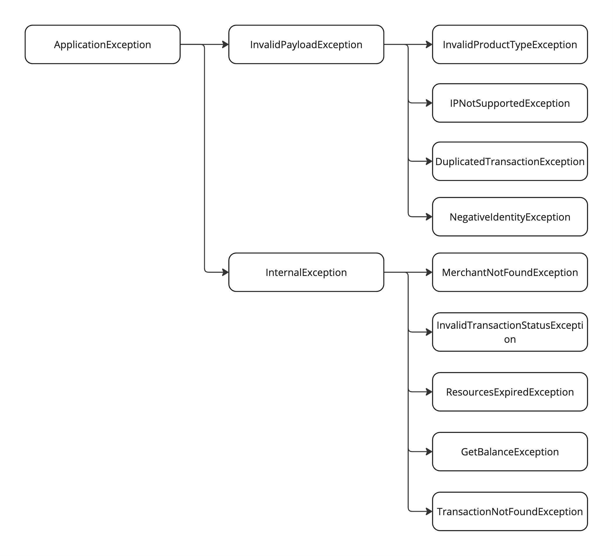

Some practices and patterns for handling exceptions in Java application.

<!--more-->

I'm building online payment software that caters to both businesses and consumers.
This software seamlessly integrates with various third-party services to facilitate secure money transfers between bank accounts.
However, such transfers involve a complex multi-step process, with potential failure points at each stage due to various factors.

To address this challenge, I'm developing a comprehensive error mapping system that provides clear and actionable information to both merchants and consumers.
This ensures transparency without compromising internal system details.

By relying on HTTP status isn't sufficient for this system.
HTTP protocol supports 4xx errors for the client side, like unauthorized (401), forbidden action (403), or unprocessible entity (422).
Any invalid format in the payload results bad request (400). The project wants to support more detailed errors, hence there is requirement to generate more details in the error response.

Here is the basic user exception handling to start with.

Since the app is written in Java and Spring Boot, the basic validation rules are handled by Spring Boot Validation framework.
Any violation will be reported in the `ConstraintViolation` set for further process.

Spring Boot supports the `@Valid` annotation when defining the controller action, which throws an error of `ConstraintViolationException` for the details of any violation in the request payload.
Further more, Spring Boot supports Error Handling involves `ControllerAdvice`, `ResponseStatusException`, `ExceptionHandler` that helps to structurize the error handling logic. 
If the app performs validation logic programmatically (calling the `validator` bean function directly), the validation only returns a list of violations and doesn't throw any error, hence it doesn't utilize
the error handling support in Spring Boot.

In a small project, directly handling the predefined `ConstraintViolationException` class should be a good enough solution. The entire process of validating the request payload, capturing the violations,
and generate the exception object which contains the information of the user error are done out of the box. The only missing part is to generate the error response from the exception object.
The exception object provides 2 methods `getPropertyPath` and `getMessage`, which tells the field name and the reason the validation fails.

By default, Spring Boot Validator supports a few validator annotations, including `NotNull`, `NotBlank`, `Min`, `Max`, `Size`, `Pattern`, these validator rules may not be enough to validate the user input.
Luckily, it isn't difficult to define a new validator, this [post][1] is the most simple tutorial I could find on Internet for defining customizable validator.

Until now, the validation logic still only handle field validation. For collaborative fields logic, such as the postal code format uses different formats for each supported country,
or the amount is required when the transaction type is transferable, for non-transferable types, the amount can be omitted.
For these validation logic, it is simpler to call the validator bean directly with the [Group validation contraints][2].

With that additions, the app still works well with the Spring Boot predefined exception class, and we don't need to define new flow to return user's error response. 
Any error occurs after the validation step could be treated as **Internal** error, hence the common practice is to return a generic internal error message.

Unfortunately, for a payment service, this level of detail doesn't provide enough context for the merchants to make the decision.
There could be an error with the bank website, or the bank account got blocked by any reason, or the transaction limit exceeded, or the card info is in the blacklist, etc.
These info aren't only helpful for our system, but also help to protect the merchant from making decision from their end. Which means the payment service has to construct the error payload
that allows the merchant system to understand to react upon the returning error.

Before I get deeper into the design of the merchant error code mapping, I think this part is worth to mention.
Spring Boot `ConstraintViolationException` is limited for our needs. To effectively handle both validation exceptions and other exceptions, a robust error hierachy is needed.
[Java error hierachy][3] has predefined the difference between error, and exception. Most projects has the own set of error class, where the base error class is inherit from the `RuntimeException`.
It is rarely a good idea to throw a predefined error by Java, for instance the app shouldn't throw `NullPointerException`, instead, it handles the logic to prevent this exception to be thrown.

In the payment project, there are a base exception class, and other exception inherits from it.
As exception is a Java object, it shares the common OOP attributes with other POJOs, hence the exception could carry some information to use in the exception handler.
This class could be an abstract class to avoid developers to use it directly.

The first exception class the project should have is `InvalidPayloadException`, and this exception inherits from the base exception class.
Other validation exceptions (related to validating user request payload) could inherit from this `InvalidPayloadException`.

After the request is piped into the controller action, more programmatically validations could be executed, where the custom exceptions are thrown. The `ExceptionHandler` allows multiple exception class
to be handled by a handling logic. However it is more complicated if the structure of the exception isn't the same. As mentioned above, the `ConstraintViolationException` has 2 methods to retrieve the field name and the failing reason,
but the custom exception may not follow this setup.

A simple solution is having a middle step to handle the `ConstraintViolationException` and rethrow the corresponding subclass of the `InvalidPayloadException` (application defined exception class).
The app could have a map of field name to the exception class.

Next exception is the `InternalException`, which also inherits from the base exception class. All other exceptions should inherit this exception class.
These exceptions are used when any step in processing the user request cause an error. There should be no predefined exception throwed, only the application defined exception.

Now we have the exceptions setup correctly, we can discuss about aggregating the exception and construct the error response.
[Pattern matching][4] simplifies the mapping a lot with a switch statement, where the app can map certain exception classes to a merchant facing error code.
The mapping could be many-to-one or one-to-one. In my case, it is many-to-one since the many exceptions are used for internal, those results the same merchant error code.

The app is written in micro-services fashion, there are internal error codes and external error codes mapping.
The internal error codes are useful for other internal consumer services to define the actions on the returning error code.
The error codes are also captured in database and logs for further auditting and business intelligence purpose.

Java Stream allows to swallow the exceptions, and return the error at the end. By utilizing this feature, the app can ignore the exception until the end of the process.
It is useful for batch processing, such as performing multiple risk calculation rules for an incoming transaction, when several calculations failed, the process continues.
At the end of the process, depends on the returned values of these successful evaluations, and the exception details, the software determine to stop or continue processing the request.
Another example is uploading photos attached in a new post, the upload could be failed but the post is still created. Hence these exceptions shouldn't failed the process.

That's it, thanks for reading this post. People come to a programmer blogs and see no code or diagram, it isn't satisfied, so here they are

- Application Exception hierachy
    
- Use Pattern matching to map the exception class to merchant error code

    ```java
        // In the actual code, the merchantErrorCode is defined as enum, for simplicity, it is passed as a string
        return switch (exception) {
            case InvalidPayloadException e -> MerchantErrorCode.builder().httpErrorCode(400).merchantErrorCode("ME400").build;
            case GetBalanceException e -> MerchantErrorCode.builder().httpErrorCode(422).merchantErrorCode("ME402").build;

            default: // handle unexpected exception (not from the application exceptions)
        }
    ```
- Catch `ConstraintViolationException` and return an application exception (subclass of `InvalidPayloadException`)

    ```java
        //  @ExceptionHandler(value = {ConstraintViolationException.class})

        return switch (exception.getPropertyPath()) {
            case RequestPayloadDto.Fields.transactionStatus -> throw new InvalidTransactionStatusException(exception.getMessage());
            // other cases
        }
    ```

[1]: https://www.baeldung.com/spring-mvc-custom-validator
[2]: https://www.baeldung.com/javax-validation-groups
[3]: https://data-flair.training/blogs/java-exception/
[4]: https://docs.oracle.com/en/java/javase/21/language/pattern-matching-switch-expressions-and-statements.html

