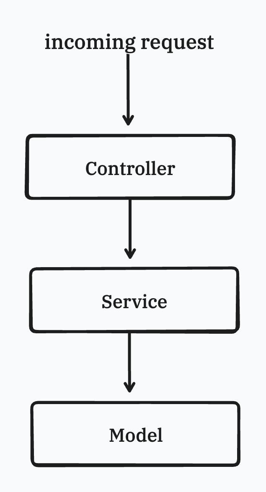

In Model-View-Controller applications, a common practice is to introduce service objects to encapsulate business logic and manage the interaction to external systems. While service objects are useful abstraction, further structuring them could improve the code organization and maintainability.

Command Query Separation (CQS) is a design pattern principle that defines the incoming request handler type, which is either modify the application state - commands, or retrieving data without any side effect - queries. By applying CQS to service objects, we can create clean interface. This blog post will explore further the benefits of CQS and how to create command and query objects in existing application.

<!--more-->

## Service Object's challenges

When using service objects, the application architecture is structured as follows



Anything could be thrown to the service layer, which is a good convenience at first. When the project grows, the service layer also grows and become complicated to maintain. Take a look at this services diagram


The service layer can quickly become bloated since any type of business logic can be encapsulated within. When start working on a new feature, developers often plan to create new service object if no existing service. The more features developed, the higher number of service objects added, which makes the system more complex and difficult to maintain.

In addition, service objects can introduce dependencies on one another, creating a tangled relationship between services. This adds more difficulty to understand and modify, as changes one service may have unintended consequences to others.

An effort could be made to unify the service's interfaces, however, this is going to be a challenging task that developers may overlook. A standardized interface is introduced early in the project, it may become technical debt that is abandoned when the requirements are evolved.

## Command Query Separation

To improve maintainability, testability and code readability, the service object could be categorized either as command object, which modifies the application's state, or query object, which returning data without side effects.

By using this definition, an interface could be introduced for all Command handlers.


```golang
type CommandHandler[C any] interface {
	Handle(ctx context.Context, cmd C) error
}
```

The command handler receives a `C` generic command object, which is just a Go struct.
Each specific command handler could specifies its `C` parameter type, performs some actions and returns an error represents if the actions was completed.

Let's say we are building a command to create an article, the command receives a struct contains field `Title` and field `Body`.
This setup looks like below:

```golang
type CreateArticle struct {
	Title string
    Body  string
}

type CreateArticleHandler = common.CommandHandler[CreateArticle]

type createArticleHandler struct {
}

func (c createArticleHandler) Handle(ctx context.Context, cmd CreateArticle) error {
    // TODO
}
```

`CreateArticleHandler` is an interface that implements the generic `CommandHandler` interface, tailored in handling `CreateArticle` command.
The code defines the `CreateArticleHandler` as a type follows the  `CommandHandler`, where the generic type is replaced by `CreateArticle`.
Later on, it creates a struct `createArticleHandler` in lowercase that implement the `CreateArticleHandler`, it means the `createArticleHandler` must
have the `Handle` function that accepts a `CreateArticle` object as an input.

For Query handlers, the interface looks a bit different

```golang
type QueryHandler[Q any, R any] interface {
	Handle(ctx context.Context, q Q) (R, error)
}
```

The query handler receives a `Q` generic query object and a `R` generic result object, which are go struct.
Similar to the command handler, each query handler despecifiesfines its Q and R types, performs some actions and returns the result with type R and an error represents if the process was successful.

```golang
type GetArticle struct {
	ID uuid.UUID
}

type GetArticleHandler = common.QueryHandler[GetArticle, *domain.Article]

type getArticleHandler struct {
	repo domain.Repository
}

func (c getArticleHandler) Handle(
	ctx context.Context,
	q GetArticle,
) (*domain.Article, error) {
	article, err := c.repo.GetArticle(ctx, q.ID)
	if err != nil {
		return nil, err
	}

	return article, nil
}
```

`GetArticleHandler` is an interface that implements the generic `QueryHandler` interface, specified in handling `GetArticle` query and returning the `Article` pointer from the domain package. 
It uses a private struct `getArticleHandler` that implements the `GetArticleHandler` interface, so this struct has a `Handle` function that accepts a `GetArticle` object as an input, then constructs and returns the `Article` pointer.

In this example, the `getArticleHandler` has an dependency to the `Article` repository. 
The repository handles the interaction with the data source to fetch the article. With a simple `GetArticle` function provided by the repository, the query doesn't require to know how the repository get the article from, this helps to encapsulate the persistence logic from the query object.

## CQS Advantages

The CQS pattern could be confused with the CQRS (Common Queue Responsibility Segregation), they both have the Command and Query concepts.
The CQRS is usually implemented with an event bus, the pattern is popular in a system built with microservice architecture.

CQS emphrasizes the separation of commands and queries and could apply to any existing architecture. When introducing CQS to an application, the application
is easier to test, improve the scalability and establishing a clear structure.

In term of testing, the query doesn't create any side effect, hence the test focus on the construct the query result from its dependencies. From the above example,
the `GetArticleHandler` only depends on the repo, the test can simulate happy path and non-happy path by assuming the result returning by the repository.
Testing the command is different, since the command doesn't return a value but an error, the testing focuses on the side effect it makes.
By focusing in a single aspect, the test scenario is more comprehend to build and maintain.

The command and query implements the generic command handler and query handler interface, additional functionalities such as logging could be implemented without touching to the command/query handler.
To provide a clear picture, here is a pattern I am using when defind the command handler. The query decorators could be implemented with similar approach. 
 
```golang
baseHandler := createArticleHandler{}

createArticleHandler := DecorateCommand(baseHandler, zerolog.New(os.StdErr))

func DecorateCommand[H any](handler CommandHandler[H], logger: logger) {
	return commandLogging {
		base:   handler,
		logger: logger
	}
}

type commandLogging[C any] struct { // implement CommandHandler
	base: CommandHandler[C]
	logger: zerolog.Logger
}

func (d commandLogging[C]) Handle(ctx context.Context, cmd C) (err error) {
	logger := d.logger.
		With().
		Str("command", generateActionName(cmd)).
		Str("command_body", fmt.Sprintf("%+v", cmd)).
		Logger()

	logger.Debug().Msg("Executing Command")

	defer func() {
		if err == nil {
			logger.Info().Msg("Command executed successfully")
		} else {
			logger.Error().Err(err).Msg("Failed to execute command")
		}
	}()

	return d.base.Handle(ctx, cmd)
}

```

This setup adheres to the **open for extension, closed for modification** principle, enabling the addition of logging functionality without altering the `createArticleHandler` function directly.

The DecorateCommand function applies the decorators, wrapping the original handler with a commandLogging struct. 
This allows for the application of multiple decorators to the original handler, each providing additional functionalities while keeping the original handler agnostic to these modifications.

## Recap

CQS enhances the modularity and maintainability of the application by separating commands (which modify the system state) from queries (which retrieve information). 
This alignment with the Domain-Driven Design (DDD) paradigm, which favors the Command-Query Separation (CQS) pattern, makes the transition to a DDD-based architecture more seamless.

