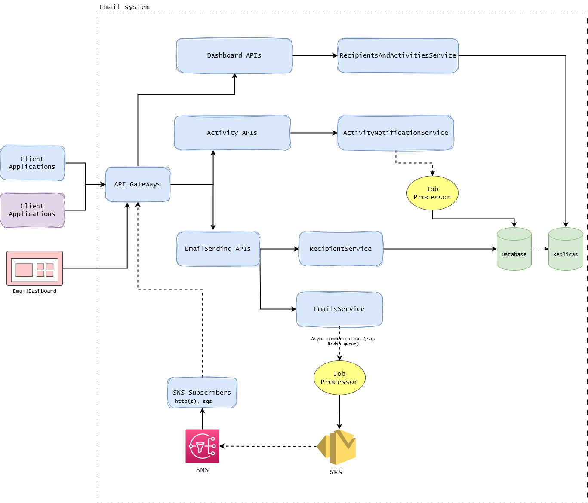
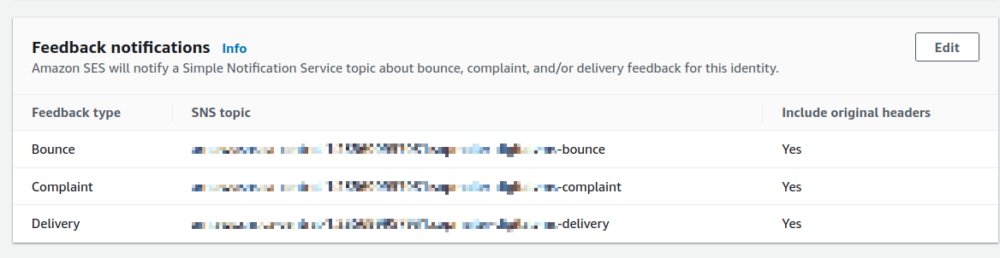
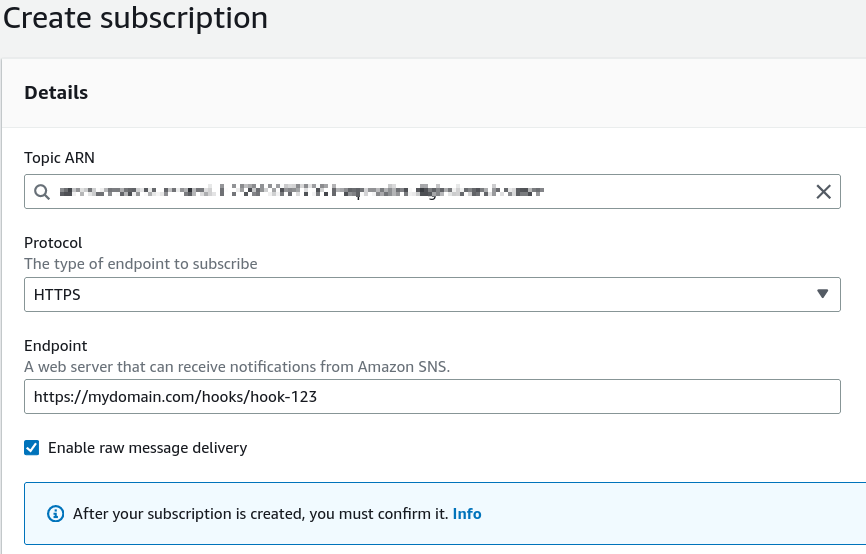
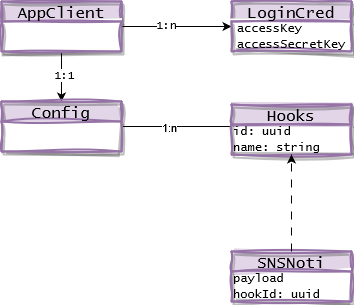
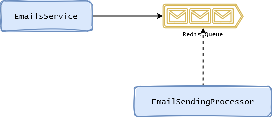
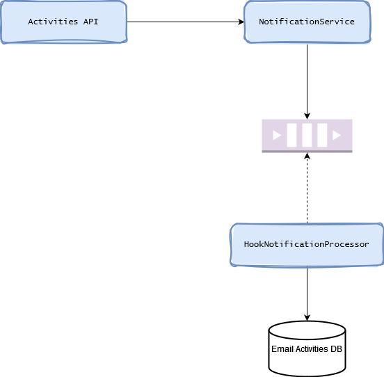

This post explains in detailed how to track email sending activities using SNS HTTPs endpoint.

<!--more-->

# Introduction

The email sending function is a common feature found in almost every website. For developers, [AWS SES (AWS Simple Email Service)][12] is a popular choice, particularly when the website is hosted on the AWS cloud. Although AWS SES doesn't directly support email activity tracking, it does offer the possibility to create custom tracking features by integrating with other AWS services. In this post, I will explain how to build an application that tracks email sending activities using SNS HTTPs endpoint.

# SES Setup

## Configure AWS SES

Implementing email communication with AWS SES is a straightforward task, thanks to the support of various programming languages provided by [AWS developer tools][2]. 
To send an email using SES, we can directly call the AWS SDK. Here's an example using NodeJS:

```js
  const client = new SESClient(config);
  AWS.config.loadFromPath('./credentials.json'); // for testing purpose

  const command = new SendEmailCommand({
    Destination: {
      ToAddresses: ['testemail@gmail.com'],
    },
    Message: {
      Subject: { Data: 'Test Subject' },
      Body: {
        Text: {
          Charset: 'UTF-8',
          Data: 'This is a test email',
        }
      }
    },
    Source: 'noreply@mydomain.com',
  });
  
  const response = await client.send(command);
```

For production ready, I am using the [NodeMailer package](https://nodemailer.com/) instead, which provides a slightly better interface:

```js
  const ses = new aws.SES({});

  const message = {
    from: 'noreply@mydomain.com',
    to: 'testemail@gmail.com',
    subject: 'Test Subject',
    text: 'body in text',
    html: '<p>HTML content</p>',
  };

  const transport = nodemailer.createTransport({
    SES: {ses, aws},
  });

  await transport.sendMail(data);
```

Rather than directly calling the SES Client, NodeMailer redirects the API call to SES through the Transport object, making it easy to switch to different transportation options. 
This flexibility is particularly helpful for developers when running the code in development and test environments. We'll explore this further in the **Testing** section later on.

## SES Dashboard

In the code example, the app only needs to pass the necessary data, such as fromEmail, toEmail, subject, body (and attachments), to the function. 
AWS SES will then handle the entire process of sending out the email.

A pressing question arises: how can we determine whether the email has been successfully delivered to the user's inbox or rejected by the user's email server?

The **SES Dashboard** provides valuable insights into account usage, such as the total number of sent emails, historical sending data, rejected rate, bouncing rate, and complaint rate. However, these metrics do not provide specific details about each individual email activity. A complete email system requires this information to troubleshoot any potential bounces or rejections caused by external factors. Thankfully, the SES Notifications feature, integrated with AWS Simple Notification Service and AWS Simple Queue Service, helps bridge this gap and provides the necessary information for a complete email system.


## Complete email system

Below is a draft design that outlines the components of an email system.



In our context, after observing how SES integration is set up in various applications, we have separated the Email sending system as a standalone application. 
This approach allows other applications to avoid managing their individual AWS configurations for email communication. Instead, they can simply make an API call to the email system, which will handle the entire lifecycle of the emails.

Here are some more details about each component:

- **API Gateway**: allows client applications, SNS Subscriber (HTTP/HTTPS) and dashboard interacts with the Email System.
- **Email Sending API**: provides API to trigger email, it handles the Emails Service that responses for communicate with the AWS SES, and the Recipients Service that creates/updates the recipients's profiles.
- **Activity API**: provides public endpoints for SNS subscriber to push the notification about the email's activities. The notification will be proceed later by a background job processor to the domain data.
- **Dashboard API**: provides APIs for the Frontend Dashboard page to connect and render the email activities data.

# AWS SES notification config

In each SES Domain Identity, there is a **Notifications** config, where it allows to setup the SNS topic for each feedback type. Here is an example:



Before setting up the SES notification, it's essential to create the required SNS Topics. In the example provided, separate topics are used for each notification type (bounce, complaint, and delivery), but a single topic can suffice for simpler use cases.

The subsequent step involves defining the subscription for the SNS Topic, for which we'll be using the HTTPs (or HTTP) protocol in this blog post.
AWS SNS supports various other subscription types, including SQS (event queue), email, and SMS subscriptions.

To create the HTTPs subscription, select the subscription type and provide the endpoint URL. Please note that the endpoint URL should be publicly accessible on the internet, as private IP addresses won't work.

In the example screenshot, the website supports creating an email hook, wherein each URL is assigned a unique identifier to distinguish email notifications from different identities. However, for simpler use cases, a general URL such as `https://mydomain.local/ses_notifications` will suffice.



After creating the subscription, the SNS will make a request call with **subscription_confirm** message to the subscription URL.
The application needs to store the request payload, which contains the Subscribe URL and the Subscription Token to [confirm the subscription][5].

To confirm the subscription, we can open the SubscribeURL on the browser or implement an automated logic that calls the [ConfirmSubscriptionCommand][6] as follow:

```js
  const input = { 
    TopicArn: "STRING_VALUE",
    Token: "STRING_VALUE",
    AuthenticateOnUnsubscribe: "STRING_VALUE",
  };

  const command = new ConfirmSubscriptionCommand(input);
  const response = await client.send(command);
```

To avoid the message be formatted, SNS subscription allows to send the raw message instead of the formatted message. However, there could be some issue when reading the request body with the raw payload if the option ["Enable raw message delivery"][3] was enabled. For example, if the project uses ExpressJS (NodeJS), this [raw-body][4] package can be used to parse the request body, the default access to `request.body` doesn't return any data.

Once the subscription is confirmed, whenever an email is sent using this SES domain identity, an [HTTP request][9] is triggered from SNS to the preconfigured endpoint. The email system captures the request payload and processes it to determine whether the email is delivered successfully.

The request payload may look like this:

```json
{
   "notificationType": "Complaint",
   "complaint": {
      "complainedRecipients": [
         {
            "emailAddress": "richard@example.com"
         }
      ],
      "complaintFeedbackType": "abuse",
      "arrivalDate": "2016-01-27T14:59:38.237Z",
      "timestamp": "2016-01-27T14:59:38.237Z",
      "feedbackId": "000001378603177f-18c07c78-fa81-4a58-9dd1-fedc3cb8f49a-000000"
   },
   "mail": { // Content is trimmed }
}
```

In this example, the notificationType is "Complaint" which indicates that the email reached the recipient's mailbox but was marked as spam.

# Core components' implementation

I hope that I have covered the main concepts and functionalities of the Email System which integrates with AWS SES.
In this section, we will explore the implementation of the core components in this email system.

### Email Sending Controller

The controller exposes an API that allows other applications to make requests to send out emails. 
gRPC is used as a default choice for microservice protocol, the gRPC proto file looks like this:

```proto
message TriggerEmailAttribute {
  string fieldName = 1;
  string value = 2;
}

message EmailAttachment {
  string name = 1;
  string remoteUrl = 2;
  optional string cid = 3;
}

message TriggerEmailRequest {
  string subject = 1;
  repeated string toEmails = 2;
  string mailBody = 3;
  repeated EmailAttachment attachments = 4;
  repeated TriggerEmailAttribute attributes = 5;
}

service EmailsServiceController {
  rpc triggerEmail(TriggerEmailRequest) returns (TriggerEmailResponse) {};
}
```

The `triggerEmail` call receives an input of type `TriggerEmailRequest` and returns a response with type `TriggerEmailResponse`. The `TriggerEmailRequest` definition includes 5 fields used to make the call to the AWS SES API. In the implementation, the controller interacts with two services: the `EmailsService`, responsible for handling the email submission to AWS SES, and the `RecipientsService`, which manages the creation of recipients based on the provided information. The notifications received from the SNS Subscription are later mapped to these recipients.

By providing the `toEmails` parameter in the request object, the service allows for specifying multiple email addresses to receive the same email in a single request.

### Notification endpoints management

As the Email sending service is used by multiple applications, each application has a distinct notification endpoint for AWS SNS to publish the email notifications.

To demonstrate how to support separate endpoints for each application, the entity relationship diagram is as follows:



When an application makes an API call to the Email Sending Service, it includes the token in the meta fields to authorize the request, enabling the service to determine the email activity based on the hook id. Subsequently, when SNS subscription publishes the notification request to a hook, the system knows how to create the corresponding activity on the application's usage.

### Background Job Processor

Background jobs are crucial in modern software development for two main reasons. 
First, they handle long tasks without slowing down the main application, so users don't have to wait. 
Second, they automatically try again if something goes wrong, minimize number of tasks gets lost or left undone.

The flow for the email sending and the hook notification processing looks like below:

- Send Email flow


- Process notification flow


Let's clarify the difference between another task scheduler system, where the processor acts as the master node distributing tasks to worker nodes, and the current case.
Here, the processor is a consumer class with methods that process jobs in the queue or listen to events on the queue. For more information on tasks queue documentation, you can refer to the [bull documentation][7].

Data extraction from the notification can be done in the background as real-time updates are not required for analytic data. Parsing all the data from the payload may not be necessary, but we can store the notification for future data backfilling.

# Testing strategy

Email testing can be expensive if actual emails need to be triggered. Fortunately, there are third-party services like [MailCatcher][8] or [MailTrap][10] that provide email sandbox solutions, rendering sent emails in a web interface. This eliminates the need to trigger actual emails to test purposes.

While third-party email sandbox services are often sufficient, I opted for a slightly improved solution with [MailDev][11]. Setting up MailDev for this project was straightforward, and I'll document the configuration process here.

The `maildev` can be run in Docker, here is the Docker Composer service definition:

```Docker
  maildev:
    image: maildev/maildev
    expose:
      - "1025"
    ports:
      - "51080:1080"
```

Nothing is fancy here. The `maildev` service exposes the port 1025 for the Email App to connect, and allows the traffic to port **1080** (**51080** from host) to access the dashboard.

Since we use **NodeMailer** package, it creates a **Transport** object to connect to AWS SES API. 
To make the app send emails to **MailDev** in Dev environment, we need to create another transport object and hook it during the initialization.

The `CreateTransportService` takes in a `driver` parameter, which indicates the type of transport, the code looks like below:

```js
enum MailDriver {
  ses,
  maildev,
}

export class DummyTransportation extends StreamTransport {}

export class CreateTransportService {
  constructor(private readonly options: TransportServiceOptions) {}

  create() {
    switch (MailDriver[this.options.driver]) {
      case MailDriver.ses: {
        const ses = new aws.SES(this.options.sesConfig);

        return createTransport({
          SES: { ses: ses, aws: aws },
        }).transporter;
      }
      case MailDriver.maildev: {
        return createTransport({
          ...this.options.mailDev,
        }).transporter;
      }
      default: {
        return new DummyTransportation({
          streamTransport: true,
        });
      }
    }
  }
}
```

The `mailDev` options object is simple with port and host, which can be passed into the app through a configuration file:

```yml
  maildev:
    port: 1025
    host: maildev
```

To speed up the test running time, we can defined the `DummyTransportation` to create mock Transportation when running test.

# Capacity calculation

Understanding the traffic and data is important to determine the actual value of the platform we have developed.
The application primarily focuses on handling email sending requests from various applications within the organization. While it also offers a dashboard to monitor email activities, its main functionality revolves around efficiently managing the email communication.

To demonstrate, I will give an example how to calculate the capacity of the email system.

- Sending rate: assume the app sends out 1 email per second, or 86k emails per day, 2.6M per month
- For each email, the system stores the activities data and the recipients data
  The recipient data could be like this

  ```js
    // TypeORM syntax
    @PrimaryGeneratedColumn('increment')
    readonly id: number;
    @Column({ unique: true })
    email: string;
    @Column('json')
    attributes: RecipientAttribute[];
    readonly createdAt: Date;
    // other columns
  ```

  Each row recipient takes ~20bytes, we can assume if there are 10M of users in all managed applications, the total size of the recipients table is around **200MB**, which is very affordable.

  In the another side, the activities table could be a little bigger as the data is keep increasing. 
  Let's assume each activity takes around 30bytes, the size of the activities table would be

  - in a month: 2.6M * 30bytes = 78MB
  - in a year: 1GB
  - in 3 year: 3GB

  While storage is not a concern, the sequential scanning of the activities table may result in slow performance. On a 1GB/sec (SSD disk) speed, generating complex dashboard data queries could take up to 3 seconds without optimization. Fortunately, the use of database indexes can greatly improve query times.

  Overall, the application remains well-suited for the next three years, considering its current sending rate and user base.

# Conclusion

In conclusion, I hope you found this blog post insightful and informative. 
We've discussed some of the key aspects of the centralized Email service, though it's important to acknowledge that there are many other considerations, such as integrating it with different app clients, data tracking, and storage usage, among others. 
As someone who has been involved in this project from its inception, I feel fortunate to have had the opportunity to design the application, define its features, and develop a comprehensive plan. Implementing a robust and efficient Email system can greatly enhance communication and efficiency. However, it's important to acknowledge the challenges that arise with the complexity of email configuration.

I'm thrilled to share this approach with you, and I hope it inspires you to enhance your organization's platform. Thank you for taking the time to read this!

[1]: https://docs.aws.amazon.com/ses/latest/dg/monitor-sending-activity-console.html
[2]: https://aws.amazon.com/developer/tools/
[3]: https://docs.aws.amazon.com/sns/latest/dg/sns-large-payload-raw-message-delivery.html
[4]: https://www.npmjs.com/package/raw-body
[5]: https://docs.aws.amazon.com/sns/latest/dg/sns-message-and-json-formats.html#http-subscription-confirmation-json
[6]: https://docs.aws.amazon.com/AWSJavaScriptSDK/v3/latest/client/sns/command/ConfirmSubscriptionCommand/
[7]: https://github.com/OptimalBits/bull
[8]: https://mailcatcher.me
[9]: https://docs.aws.amazon.com/ses/latest/dg/notification-examples.html
[10]: https://mailtrap.io/
[11]: https://github.com/maildev/maildev
[12]: https://docs.aws.amazon.com/ses/index.html
