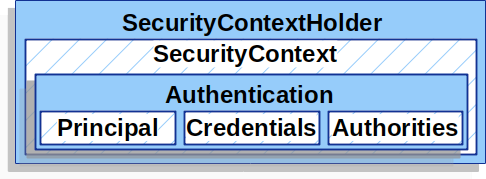

This post is a short tutorial of how to configure the spring security for your app to support user authentication using local database.

# Introduction

In Spring Boot, there is no plug-and-play like other frameworks. To get the user authentication working, you need to write some code to glue the required components working together. Spring Security was designed to be flexible with multiple authentication/authorization strategies. 

# Overview design

## Servlet Filter chains


*source from [SpringIO](https://docs.spring.io/spring-security/reference/servlet/authentication/architecture.html)*

Here is an example of configuring the security filter

```java
@Configuration
@EnableWebSecurity
public class SecurityConfig {

    @Bean
    public SecurityFilterChain filterChain(HttpSecurity httpSecurity) throws Exception {
        return httpSecurity
                .authorizeHttpRequests(authorize -> authorize
                        .requestMatchers("/demo/default")
                        .permitAll()
                        .anyRequest()
                        .authenticated()
                ).csrf(AbstractHttpConfigurer::disable)
                .httpBasic(Customizer.withDefaults())
                .build();
    }

}
```

With this security configuration, the application permits unrestricted access to the "/demo/default" path, while other paths require basic authentication. By specifying `httpBasic` configuration, it expects the `Authorization` header alongside the Basic authentication strategy, adhering to the format `Basic xxxxx`. 

## Create custom implementation of UserDetailsService interface

This service is the core service to load the user information, this has an abstract method to load the user by username (`loadUserByUsername`). The service is a dependency of `DaoAuthenticationProvider`, which handles the authentication logic.


The [Spring documentation](https://docs.spring.io/spring-security/reference/servlet/authentication/passwords/dao-authentication-provider.html) provides a detailed explanation of how these components are interconnected to execute the authentication logic using username and password.

By implementing the UserDetailsService, we can specify how SpringSecurity will fetch the user information from the local database.

```java
@Service
public class CustomUserDetailsService implements UserDetailsService {

    private final AccountRepository accountRepository;

    public CustomUserDetailsService(AccountRepository accountRepository) {
        this.accountRepository = accountRepository;
    }

    @Override
    public UserDetails loadUserByUsername(String email) throws UsernameNotFoundException {
        Account account = accountRepository.findByEmail(email);

        if (account == null) {
            throw new UsernameNotFoundException("account not found");
        }

        List<GrantedAuthority> grantedAuthorities = AuthorityUtils
                .createAuthorityList(account.getRoles().stream().map(Role::getName).toList());

        return UserDetailsImpl
                .builder()
                .id(account.getId())
                .email(account.getEmail())
                .password(account.getEncodedPassword())
                .enabled(account.getEnabled())
                .credentialsExpiredAt(account.getCredentialsExpiredAt())
                .expiredAt(account.getExpiredAt())
                .lockedAt(account.getLockedAt())
                .createdAt(account.getCreatedAt())
                .updatedAt(account.getUpdatedAt())
                .authorityList(grantedAuthorities)
                .build();
    }
}
```

The `CustomUserDetailsService` implements the `UserDetailsService`, which is an interface defined by `SpringSecurity`. It override the `loadUserByUsername` function by fetching the `account` using the repository. 
After the account is found, the service builds the authorities list by looking at the `roles` association.

In this demo, the relationship between `Account` and `Role` is many-to-many, as an account can have many roles, and a role could be attached to multiple accounts. In SpringSecurity, beside roles, there are different terminologies for granted authorities, such as `scopes` and `groups`.

The `UserDetailsImpl` is a java class that implements the Spring `UserDetails` interface. The implement could look like following

```java
@SuperBuilder
@AllArgsConstructor
public class UserDetailsImpl extends Account implements UserDetails {
    private List<GrantedAuthority> authorityList;

    @Override
    public Collection<? extends GrantedAuthority> getAuthorities() {
        return Collections.unmodifiableList(authorityList);
    }

    @Override
    public String getUsername() {
        return getEmail();
    }

    @Override
    public boolean isAccountNonExpired() {
        return getExpiredAt() == null || getExpiredAt().isBefore(Instant.now());
    }

    @Override
    public boolean isAccountNonLocked() {
        return getLockedAt() == null;
    }

    @Override
    public boolean isCredentialsNonExpired() {
        return getCredentialsExpiredAt() == null || getCredentialsExpiredAt().isBefore(Instant.now());
    }

    @Override
    public boolean isEnabled() {
        return getEnabled();
    }
}
```

In this implementation, I use some columns in the `accounts` table like `expiredAt`. In real project, these logic can be implemented differently based on the project requirements.   

## Encoded password

In Java, we can use PasswordEncoder to encode and check if the provided password is matched with the encoded password, here is a sample code to create the encoder and call its behaviors

```java
    PasswordEncoder encoder = PasswordEncoderFactories.createDelegatingPasswordEncoder();
    String encodedPassword = encoder.encode("password"); // the value of encodedPassword is "{bcrypt}$2a$10$tBC.TeiMDcNt8rBHeqB6.eFg5Yb6HxlRy7RapEyxLM9ZEhV4fDZAq";
    String rawPassword = "password";
    
    boolean isMatched = encoder.matches(rawPassword, encodedPassword);
    assertTrue(isMatched);
```

Both encoding and decoding would require the password encoder, it is a good idea to define a bean for it. SpringSecurity looks for the bean automatically. Hence the full configuration would look like following

```java
@Configuration
@EnableMethodSecurity()
public class SecConfiguration {
    @Bean
    public PasswordEncoder passwordEncoder(){
        return PasswordEncoderFactories.createDelegatingPasswordEncoder();
    }

    @Bean
    public SecurityFilterChain filterChain(HttpSecurity httpSecurity) throws Exception {
        return httpSecurity
                .authorizeHttpRequests(authorize -> authorize
                        .requestMatchers("/demo/default")
                        .permitAll()
                        .anyRequest()
                        .authenticated()
                ).csrf(AbstractHttpConfigurer::disable)
                .httpBasic(Customizer.withDefaults())
                .build();
    }
}
```

## Controller

After configuring the entire authentication logic, we can finally create a controller to test if the code works correctly

```java
@Conditional(IsDevEnvCondition.class)
@RestController
@RequestMapping("/demo")
public class DevAuthenticationController {
    private final SetupTestDataUsecase setupTestDataUsecase;

    public DevAuthenticationController(SetupTestDataUsecase setupTestDataUsecase) {
        this.setupTestDataUsecase = setupTestDataUsecase;
    }

    @GetMapping("/admin/dashboard")
    @PreAuthorize("hasRole('ADMIN')")
    public String showAdminDashboard() {
        return "Successfully access admin dashboard";
    }

    @GetMapping("/user/dashboard")
    @PreAuthorize("hasRole('USER')")
    public String showUserDashboard() {
        return "Successfully access User dashboard";
    }

    @GetMapping("/superadmin/dashboard")
    @PreAuthorize("hasRole('SUPER_ADMIN')")
    public String showSuperAdminDashboard() {
        return "Successfully access Super Admin dashboard";
    }

    @GetMapping("/default")
    public String showDefaultPage() {
        return "Without any authority, guest can see this page";
    }

    @PostMapping("/superadmin/run-me-first")
    @PreAuthorize("hasRole('SUPER_ADMIN')")
    public String runMeFirst() {
        return setupTestDataUsecase.execute();
    }
}
```

This `DevAuthenticationController` is only available in the dev environment by specifying the `@Conditional(IsDevEnvCondition.class)` annotation. This annotation is easy to write, I'd skip to talk about it to focus on the controller activities.

We need to run the `/superadmin/run-me-first`, this will create the test data. When starting the application, only the super admin account is created. We would need other roles to perform different tests, hence this endpoint helps to create other testing accounts.

The `/default` path accepts all traffics, there is no restriction on this path due to previous configuration on the `SecConfiguration`. Other path requires the basic authentication and sufficient role to access the content, for instance the `/user/dashboard` requires the account to have the `USER` role.

As mentioned earlier, an account could have multiple roles, the `setupTestDataUsecase` creates some test accounts with several roles attached:

```java
    Account adminAccount = Account
            .builder()
            .email("admin@email.com")
            .password("password")
            .enabled(true)
            .roles(Set.of(adminRole))
            .build();

    Account multiRolesAccount1 = Account
            .builder()
            .email("multiroles1@email.com")
            .password("password")
            .enabled(true)
            .roles(Set.of(userRole, adminRole))
            .build();

    Account multiRolesAccount2 = Account
            .builder()
            .email("multiroles2@email.com")
            .password("password")
            .enabled(true)
            .roles(Set.of(userRole, superAdminRole))
            .build();
    //...
    accountRepository.saveAll(accounts);
```

## Running the app

First, we can run the app in the `Run` mode, and use the `http.request` collection to test each endpoint (ensure to run the "/superadmin/run-me-first" first).

```text
### Run this request first to setup testing data
POST {{ apiUrl }}/demo/superadmin/run-me-first
Authorization: {{ authorization_token }}
Accept: application/json
Content-Type: application/json

### /admin/dashboard returns 200
GET {{ apiUrl }}/demo/admin/dashboard
Authorization: Basic superadmin@email.com password
Accept: application/json
Content-Type: application/json

### /user/dashboard returns 200
GET {{ apiUrl }}/demo/user/dashboard
Authorization: Basic user@email.com password
Accept: application/json
Content-Type: application/json

### /user/dashboard with multi roles 1 returns 200
GET {{ apiUrl }}/demo/admin/dashboard
Authorization: Basic multiroles1@email.com password
Accept: application/json
Content-Type: application/json

### /user/dashboard with multi roles 1 result 403
GET {{ apiUrl }}/demo/superadmin/dashboard
Authorization: Basic multiroles1@email.com password
Accept: application/json
Content-Type: application/json

### /user/dashboard with multi roles 2
GET {{ apiUrl }}/demo/user/dashboard
Authorization: Basic multiroles2@email.com password
Accept: application/json
Content-Type: application/json

### /default no authorization required
GET {{ apiUrl }}/demo/default
Accept: application/json
Content-Type: application/json
```

After that, we could run the app in debugger mode, here are my breakpoints for your preferences
- `DaoAuthenticationProvider`, function `retrieveUser` and `additionalAuthenticationChecks`
- `SecurityExpressionRoot`, function `hasRole` and `hasAnyAuthorityName`

Both classes mentioned here are located under SpringSecurity library, you can find them in the external libraries section, the path is `org/springframework/security/authentication/dao/DaoAuthenticationProvider.class`.

When sending the request from the `http request` above, the debugger stops at the `DaoAuthenticationProvider#retrieveUser`.
Since the `UserDetailsService` is a dependency of `DaoAuthenticationProvider`, we can check if our implementation for the `CustomUserDetailsService#loadUserByUsername` works correctly.


This screenshot shows a lot of useful information, for example the data type of the `principal`, `credential`, etc. which helps us to understand SpringSecurity better. 



We also see the `UserDetailsServices` has been used in the `DaoAuthenticationProvider` and it returns the `loadedUser` in type `UserDetailsImpl` correctly from the database.

And this screenshot shows how the `hasRole` annotation works, this annotation is used in the controller to check if the principal has sufficient authority to access the endpoint.


The code for the `hasRole` function is implemented in SpringSecurity as following:
```java
@Override
public final boolean hasRole(String role) {
    return hasAnyRole(role);
}

@Override
public final boolean hasAnyRole(String... roles) {
    return hasAnyAuthorityName(this.defaultRolePrefix, roles);
}

private boolean hasAnyAuthorityName(String prefix, String... roles) {
    Set<String> roleSet = getAuthoritySet();
    
    for (String role : roles) {
        String defaultedRole = getRoleWithDefaultPrefix(prefix, role);
        if (roleSet.contains(defaultedRole)) {
            return true;
        }
    }
    
    return false;
}
```

This `hasAnyAuthorityName` invokes a utility function `getRoleWithDefaultPrefix`, that function takes the `prefix` (ROLE_) and appends the role value (loaded from the account roles table) to construct the `defaultRole`, hence the role value in database can omit the `ROLE_` prefix.

# Conclusion

This post is a short tutorial of how to connect the SpringSecurity with the local database credentials provider to authenticate and authorize the request. Through this post, my aim is to guide you how to navigate the SpringSecurity source code using debugger tool, which I believe is an invaluable method for gaining a deeper understanding of its design. By grasping the intricacies of its structure, not only does development become more streamlined, but troubleshooting also becomes significantly more efficient.
The example repository can be found in [Github](https://github.com/duykhoa/sec).

Thanks for reading!
